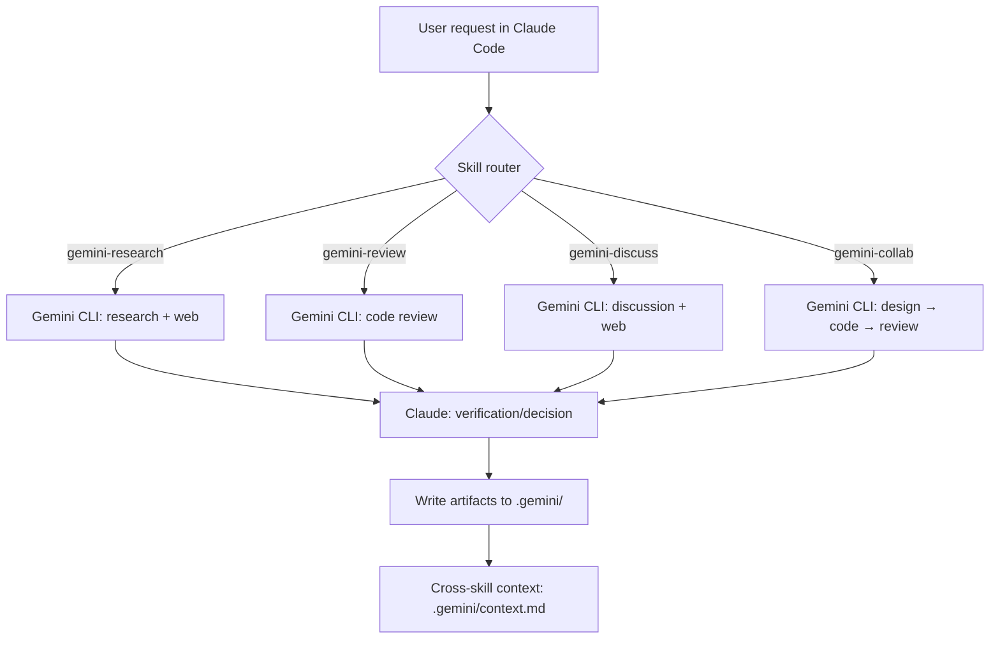

<p align="right">
  <a href="./README.md">한국어</a> | <a href="./README.md">English</a>
</p>

<!-- ===================== -->
<!-- Hero -->
<!-- ===================== -->

<h1 align="center">Claude Code + Gemini CLI Skills</h1>

<p align="center">
  Claude Code와 Gemini CLI를 연동해 <b>리서치 · 토론 · 코드리뷰 · 협업코딩</b>을 수행하고,<br/>
  <b>Claude가 Gemini 응답을 검증</b>해 최종 산출물로 정리합니다.
</p>

<p align="center">
  <a href="#quickstart">Quickstart</a> ·
  <a href="#how-it-works">How it works</a> ·
  <a href="#skills">Skills</a> ·
  <a href="#outputs">Outputs</a> ·
  <a href="#configuration">Configuration</a> ·
  <a href="#troubleshooting">Troubleshooting</a>
</p>

<p align="center">
  
  
  
  
  <!-- 릴리즈 발행 후 활성화 권장 -->
  <!--  -->
  <!--  -->
</p>

<hr/>

Claude Code와 Gemini CLI를 연동하여 두 AI가 협업하는 스킬 모음입니다.

## 개요

이 프로젝트는 Claude Code 환경에서 Gemini CLI를 활용하여 코드 리뷰, 기술 조사, AI 토론, 협업 코딩을 수행하는 4가지 스킬을 제공합니다.

### 핵심 특징

- **4개 워크플로우 표준화**: research / discuss / review / collab을 동일한 흐름(입력→실행→검증/정리→저장)으로 제공
- **결과 재현 가능한 로그/산출물 자동 저장**: 모든 실행 결과를 .gemini/에 단계별 파일로 남겨 추적·재사용·감사가 쉬움
- **이중 검증 구조**: Gemini 산출물에 대해 Claude가 검증(동의/반박/부분동의, 리뷰 결론 등)하여 오류 가능성을 낮춤
- **품질 관리 강화**: 이슈를 Critical/Major/Minor/Info로 분류하고, Critical은 즉시 수정 제안 흐름을 포함
- **협업 생산성 최적화**: discuss는 3라운드 토론과 합의점/논쟁점 분리 정리, collab은 적용 전 확인 + 테스트 실행 제안으로 “실행 가능한 결론”까지 연결
- **지식 재사용/연결**: research의 유사 주제 캐싱, 모든 스킬에서 활용 가능한 **크로스-스킬 컨텍스트(.gemini/context.md)**로 반복 작업 감소
- **최신성·안정성 확보**: 웹 검색 기반 근거 제시(해당 스킬) + 모델 자동 fallback으로 작업 연속성 강화

## Quickstart

```bash
git clone https://github.com/dbaek-star/claude-gemini-skills.git
cd claude-gemini-skills

# macOS / Linux
chmod +x install.sh && ./install.sh

# Windows (PowerShell)
# .\install.ps1
```

Claude Code 세션에서 자연어로 요청하면 자동으로 해당 스킬이 활성화됩니다:
#### Example Prompt
- “`src/utils/parser.py` 파일을 Gemini로 리뷰해줘”
- “Gemini로 조사해줘: 위성 영상 분류에서 U-Net vs DeepLabV3+ 비교”

## How it works



## Skills

| Skill | 설명 | 실행 방식 | Typical triggers |
|---|---|---:|---|
| **gemini-research** | Gemini로 기술 조사 + Claude 검증 | 메인 컨텍스트 | “Gemini로 조사해줘”, “비교해줘”, “최신 정보 확인” |
| **gemini-discuss** | Gemini와 주제 토론 + Claude 반론 | Subagent | “Gemini와 논의해줘”, “장단점 토론”, “대안 비교” |
| **gemini-review** | Gemini 코드 리뷰 + Claude 동의/반박 | 메인 컨텍스트 | “Gemini로 리뷰해줘”, “이 파일/함수 검토” |
| **gemini-collab** | Gemini와 협업 코딩 (설계→코드→리뷰) | Subagent | “Gemini와 함께 개발”, “설계부터 구현까지” |

## 요구사항

- [Claude Code](https://claude.com/claude-code) 설치
- [Gemini CLI](https://github.com/google-gemini/gemini-cli) 설치 및 인증
- Windows / macOS / Linux

## 설치 방법

### 1. 저장소 클론

```bash
git clone https://github.com/dbaek-star/claude-gemini-skills.git
cd claude-gemini-skills
```

### 2. 설치 스크립트 실행

**Windows (PowerShell):**
```powershell
.\install.ps1
```

**macOS / Linux:**
```bash
chmod +x install.sh
./install.sh
```

<details>
<summary>수동 설치 (스크립트 없이)</summary>

**Windows:**
```powershell
# 스킬 디렉토리 생성
mkdir "$env:USERPROFILE\.claude\skills\gemini-collab" -Force
mkdir "$env:USERPROFILE\.claude\skills\gemini-discuss" -Force
mkdir "$env:USERPROFILE\.claude\skills\gemini-research" -Force
mkdir "$env:USERPROFILE\.claude\skills\gemini-review" -Force

# 파일 복사
Copy-Item "skills\gemini-collab\SKILL.md" "$env:USERPROFILE\.claude\skills\gemini-collab\"
Copy-Item "skills\gemini-discuss\SKILL.md" "$env:USERPROFILE\.claude\skills\gemini-discuss\"
Copy-Item "skills\gemini-research\SKILL.md" "$env:USERPROFILE\.claude\skills\gemini-research\"
Copy-Item "skills\gemini-review\SKILL.md" "$env:USERPROFILE\.claude\skills\gemini-review\"
```

**macOS / Linux:**
```bash
mkdir -p ~/.claude/skills/gemini-{collab,discuss,research,review}

cp skills/gemini-collab/SKILL.md ~/.claude/skills/gemini-collab/
cp skills/gemini-discuss/SKILL.md ~/.claude/skills/gemini-discuss/
cp skills/gemini-research/SKILL.md ~/.claude/skills/gemini-research/
cp skills/gemini-review/SKILL.md ~/.claude/skills/gemini-review/
```

</details>

### 3. Prerequisites

```bash
# Gemini CLI 설치 (npm)
npm install -g @google/gemini-cli

# 첫 실행 시 자동으로 인증 프로세스 시작
gemini
```

> 자세한 설치 방법: https://github.com/google-gemini/gemini-cli


## 사용법

Claude Code 세션에서 자연어로 요청하면 자동으로 해당 스킬이 활성화됩니다.

### gemini-research (기술 조사)

```
Gemini로 조사해줘: 위성 영상 분류에서 U-Net vs DeepLabV3+ 비교
```

### gemini-discuss (AI 토론)

```
Python에서 async/await vs threading에 대해 Gemini와 논의해줘
```

### gemini-review (코드 리뷰)

```
src/utils/parser.py 파일을 Gemini로 리뷰해줘
```
```
이 함수를 Gemini한테 검토받아줘:
def calculate_ndvi(nir, red):
    return (nir - red) / (nir + red)
```

### gemini-collab (협업 코딩)

```
Sentinel-2 위성영상에서 NDVI를 계산하는 Python 함수를 Gemini와 협업해서 작성해줘
```

## Outputs

모든 작업 산출물은 프로젝트 디렉토리 내 `.gemini/` 폴더에 저장됩니다.

- 목적: 실행 로그 / 입력 프롬프트 / Gemini 결과 / Claude 검증 / 최종본을 한 번에 추적
- 공통: 최종본은 `*_final.md` 또는 `*_summary.md` 형태로 저장

```
{프로젝트루트}/.gemini/
├── research/{타임스탬프}_{주제}/
│   ├── research_input.txt
│   ├── research_gemini.md
│   ├── research_claude_verification.md
│   └── research_final.md
├── discuss/{타임스탬프}_{주제}/
│   ├── discuss_input.txt
│   ├── discuss_gemini_1.md
│   ├── discuss_claude_review_1.md
│   └── discuss_summary.md
├── review/{타임스탬프}_{대상}/
│   ├── review_input.txt
│   ├── review_gemini.md
│   ├── review_claude_decision.md
│   └── review_final.md
└── collab/{타임스탬프}_{주제}/
    ├── collab_design.txt
    ├── collab_code.txt
    ├── collab_final_code.txt
    └── collab_summary.md
```

## Configuration

### Gemini 모델

- **기본 모델**: `gemini-3-pro-preview`
- **Fallback 모델**: `gemini-3-flash-preview` (기본 모델 실패 시 자동 전환)

### 프롬프트 규칙

- 모든 Gemini 프롬프트 끝에 `ultrathink` 키워드 포함 (깊은 추론 활성화)
- 웹 검색이 필요한 스킬에서는 "웹 검색을 통해 최신 정보를 확인하고, 출처를 함께 제시해주세요." 포함

## 버전 정보

**v4.0.0** (2026-02-05)

- **[NEW] 기존 조사 캐싱**: research 스킬에서 유사 주제 재활용 여부 확인
- **[NEW] 다중 파일 리뷰**: review 스킬에서 디렉토리 지정 시 여러 파일 순차 리뷰
- **[NEW] 심각도 분류**: Critical/Major/Minor/Info 4단계 분류 (review)
- **[NEW] 즉시 수정 제안**: Critical 이슈 발견 시 AskUserQuestion으로 즉시 수정 제안
- **[NEW] 3라운드 토론**: discuss 스킬 최대 라운드 2→3 확장
- **[NEW] 합의점/논쟁점 분리**: discuss 결론 형식 개선
- **[NEW] 코드 적용 확인**: collab 스킬에서 코드 적용 전 사용자 확인
- **[NEW] 테스트 실행 제안**: collab 완료 후 테스트 실행 여부 제안
- **[NEW] 진행 상황 표시**: 모든 스킬에서 단계별 텍스트 출력
- **[NEW] 크로스-스킬 컨텍스트**: `.gemini/context.md` 연동

**v3.1.0** (2025-02-05)

- 모델 선택: `gemini-3-pro-preview` 기본, `gemini-3-flash-preview` fallback
- Claude 검증 단계 추가
- 웹 검색 통합 (research, discuss, collab 설계 단계)
- `ultrathink` 키워드 추가
- Subagent 토큰 최적화 (discuss, collab)

## Troubleshooting

### Gemini CLI가 실행/인증되지 않아요
- `gemini`를 터미널에서 단독 실행하여 초기 인증 확인 

### 산출물이 안 쌓여요
- 프로젝트 루트에 `.gemini/` 폴더가 생성되는지 확인
- 실행 권한/경로 문제(특히 Windows PowerShell) 여부 확인

## 라이선스

MIT License - 자유롭게 사용, 수정, 배포 가능합니다.

## 기여

이슈 및 Pull Request 환영합니다.

## 관련 링크

- [Claude Code](https://claude.com/claude-code)
- [Gemini CLI](https://github.com/google-gemini/gemini-cli)
