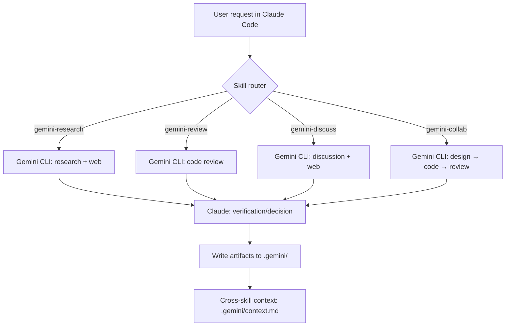

<p align="right">
  <a href="./README.kor.md">한국어</a> | <a href="./README.en.md">English</a>
</p>
<!-- ===================== -->
<!-- Hero -->
<!-- ===================== -->

<h1 align="center">Claude Code + Gemini CLI Skills</h1>

<p align="center">
  Integrate Claude Code with Gemini CLI to run <b>research · discussion · code review · collaborative coding</b>,<br/>
  then have <b>Claude verify Gemini’s responses</b> and compile the final deliverables.
</p>

<p align="center">
  <a href="#quickstart">Quickstart</a> ·
  <a href="#how-it-works">How it works</a> ·
  <a href="#skills">Skills</a> ·
  <a href="#outputs">Outputs</a> ·
  <a href="#configuration">Configuration</a> ·
  <a href="#troubleshooting">Troubleshooting</a>
</p>

<p align="center">
  
  
  
  
  <!-- Recommended to enable after publishing GitHub Releases -->
  <!--  -->
  <!--  -->
</p>

<hr/>

A collection of skills that connect Claude Code and Gemini CLI so two AIs can collaborate.

## Overview

This project provides four skills for the Claude Code environment that use Gemini CLI to perform code review, technical research, AI discussion, and collaborative coding.

### Key Features

- **Standardized 4 workflows**: Provides research / discuss / review / collab with the same flow (input → run → verify/summarize → save)
- **Reproducible logs & artifacts**: Saves every run into step-by-step files under `.gemini/` for easy traceability, reuse, and auditing
- **Two-stage verification**: Claude verifies Gemini outputs (agree/disagree/partial agreement, review decisions, etc.) to reduce error risk
- **Stronger quality control**: Classifies issues as Critical/Major/Minor/Info, and includes an “immediate fix suggestion” flow for Critical items
- **Optimized collaboration productivity**: discuss supports 3 rounds and summarizes agreements vs. disputes; collab includes pre-apply confirmation + test run suggestion to reach “actionable conclusions”
- **Knowledge reuse & linkage**: Similar-topic caching in research, plus a shared **cross-skill context (`.gemini/context.md`)** to reduce repeated work across skills
- **Freshness & reliability**: Web-search-backed evidence (where applicable) + automatic model fallback to keep work moving

## Quickstart

```bash
git clone https://github.com/dbaek-star/claude-gemini-skills.git
cd claude-gemini-skills

# macOS / Linux
chmod +x install.sh && ./install.sh

# Windows (PowerShell)
# .\install.ps1
```

In a Claude Code session, asking in natural language will automatically activate the appropriate skill:

#### Example Prompt
- “Please review `src/utils/parser.py` with Gemini”
- “Research with Gemini: U-Net vs DeepLabV3+ for satellite image classification”

## How it works



## Skills

| Skill | Description | Execution mode | Typical triggers |
|---|---|---:|---|
| **gemini-research** | Technical research with Gemini + Claude verification | Main context | “Research with Gemini”, “Compare options”, “Check latest info” |
| **gemini-discuss** | Topic discussion with Gemini + Claude rebuttal | Subagent | “Discuss with Gemini”, “Pros/cons debate”, “Compare alternatives” |
| **gemini-review** | Code review with Gemini + Claude agree/disagree | Main context | “Review with Gemini”, “Check this file/function” |
| **gemini-collab** | Collaborative coding with Gemini (design → code → review) | Subagent | “Build with Gemini”, “From design to implementation” |

## Requirements

- Install [Claude Code](https://claude.com/claude-code)
- Install and authenticate [Gemini CLI](https://github.com/google-gemini/gemini-cli)
- Windows / macOS / Linux

## Installation

### 1. Clone the repository

```bash
git clone https://github.com/dbaek-star/claude-gemini-skills.git
cd claude-gemini-skills
```

### 2. Run the install script

**Windows (PowerShell):**
```powershell
.\install.ps1
```

**macOS / Linux:**
```bash
chmod +x install.sh
./install.sh
```

<details>
<summary>Manual installation (without scripts)</summary>

**Windows:**
```powershell
# Create skill directories
mkdir "$env:USERPROFILE\.claude\skills\gemini-collab" -Force
mkdir "$env:USERPROFILE\.claude\skills\gemini-discuss" -Force
mkdir "$env:USERPROFILE\.claude\skills\gemini-research" -Force
mkdir "$env:USERPROFILE\.claude\skills\gemini-review" -Force

# Copy files
Copy-Item "skills\gemini-collab\SKILL.md" "$env:USERPROFILE\.claude\skills\gemini-collab\"
Copy-Item "skills\gemini-discuss\SKILL.md" "$env:USERPROFILE\.claude\skills\gemini-discuss\"
Copy-Item "skills\gemini-research\SKILL.md" "$env:USERPROFILE\.claude\skills\gemini-research\"
Copy-Item "skills\gemini-review\SKILL.md" "$env:USERPROFILE\.claude\skills\gemini-review\"
```

**macOS / Linux:**
```bash
mkdir -p ~/.claude/skills/gemini-{collab,discuss,research,review}

cp skills/gemini-collab/SKILL.md ~/.claude/skills/gemini-collab/
cp skills/gemini-discuss/SKILL.md ~/.claude/skills/gemini-discuss/
cp skills/gemini-research/SKILL.md ~/.claude/skills/gemini-research/
cp skills/gemini-review/SKILL.md ~/.claude/skills/gemini-review/
```

</details>

### 3. Prerequisites

```bash
# Install Gemini CLI (npm)
npm install -g @google/gemini-cli

# First run starts the authentication flow
gemini
```

> Detailed installation guide: https://github.com/google-gemini/gemini-cli


## Usage

In a Claude Code session, asking in natural language will automatically activate the appropriate skill.

### gemini-research (technical research)

```
Research with Gemini: U-Net vs DeepLabV3+ for satellite image classification
```

### gemini-discuss (AI discussion)

```
Discuss async/await vs threading in Python with Gemini
```

### gemini-review (code review)

```
Please review src/utils/parser.py with Gemini
```
```
Ask Gemini to review this function:
def calculate_ndvi(nir, red):
    return (nir - red) / (nir + red)
```

### gemini-collab (collaborative coding)

```
Collaborate with Gemini to write a Python function to compute NDVI from Sentinel-2 imagery
```

## Outputs

All artifacts are saved under the `.gemini/` folder inside the project directory.

- Purpose: Track execution logs / input prompts / Gemini outputs / Claude verification / final deliverables end-to-end
- Convention: Final deliverables are saved as `*_final.md` or `*_summary.md`

```
{project_root}/.gemini/
├── research/{timestamp}_{topic}/
│   ├── research_input.txt
│   ├── research_gemini.md
│   ├── research_claude_verification.md
│   └── research_final.md
├── discuss/{timestamp}_{topic}/
│   ├── discuss_input.txt
│   ├── discuss_gemini_1.md
│   ├── discuss_claude_review_1.md
│   └── discuss_summary.md
├── review/{timestamp}_{target}/
│   ├── review_input.txt
│   ├── review_gemini.md
│   ├── review_claude_decision.md
│   └── review_final.md
└── collab/{timestamp}_{topic}/
    ├── collab_design.txt
    ├── collab_code.txt
    ├── collab_final_code.txt
    └── collab_summary.md
```

## Configuration

### Gemini models

- **Default model**: `gemini-3-pro-preview`
- **Fallback model**: `gemini-3-flash-preview` (automatically used if the default fails)

### Prompt rules

- Append the `ultrathink` keyword to the end of every Gemini prompt (to encourage deeper reasoning)
- For skills that require web search, include: “Use web search to verify the latest information and provide sources.”

## Version

**v4.0.0** (2026-02-05)

- **[NEW] Research caching**: research checks whether similar topics can be reused
- **[NEW] Multi-file review**: review can sequentially review multiple files when a directory is provided
- **[NEW] Severity classification**: Critical/Major/Minor/Info 4-level categorization (review)
- **[NEW] Immediate fix suggestion**: if a Critical issue is found, suggest an immediate fix via AskUserQuestion
- **[NEW] 3-round discussion**: discuss max rounds expanded 2 → 3
- **[NEW] Separate agreements vs. disputes**: improved discussion conclusion format
- **[NEW] Pre-apply confirmation**: collab asks for confirmation before applying code
- **[NEW] Test run suggestion**: collab suggests running tests after completion
- **[NEW] Progress indicators**: step-by-step progress output for all skills
- **[NEW] Cross-skill context**: `.gemini/context.md` integration

**v3.1.0** (2025-02-05)

- Model selection: `gemini-3-pro-preview` default, `gemini-3-flash-preview` fallback
- Added Claude verification step
- Web search integration (research, discuss, collab design stage)
- Added `ultrathink` keyword
- Subagent token optimization (discuss, collab)

## Troubleshooting

### Gemini CLI does not run / authenticate
- Run `gemini` directly in your terminal to confirm initial authentication is complete

### Artifacts are not being saved
- Check whether the `.gemini/` folder is created in the project root
- Verify execution permission/path issues (especially on Windows PowerShell)

## License

MIT License — free to use, modify, and distribute.

## Contributing

Issues and Pull Requests are welcome.

## Links

- [Claude Code](https://claude.com/claude-code)
- [Gemini CLI](https://github.com/google-gemini/gemini-cli)
